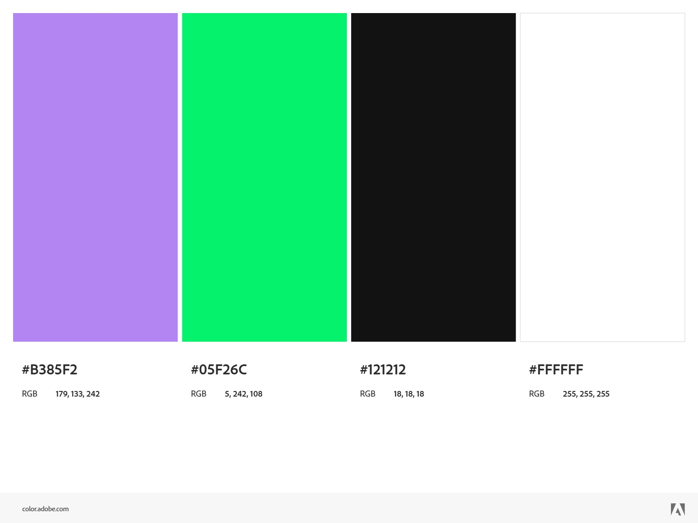
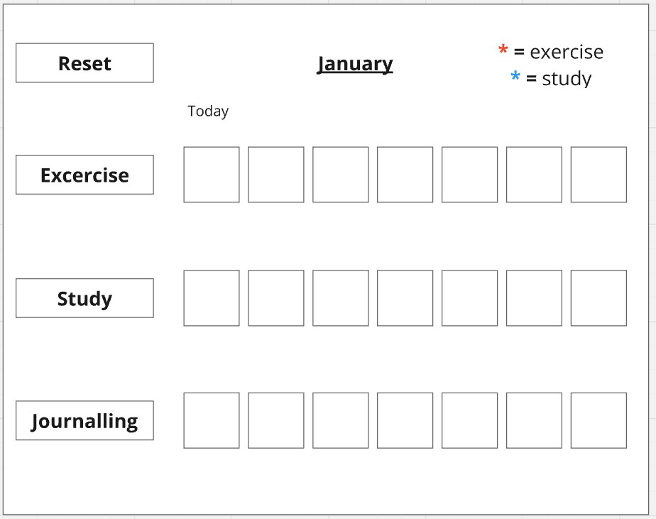
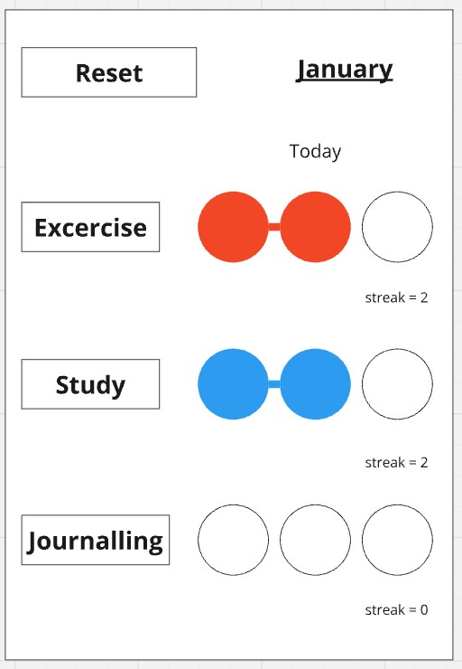
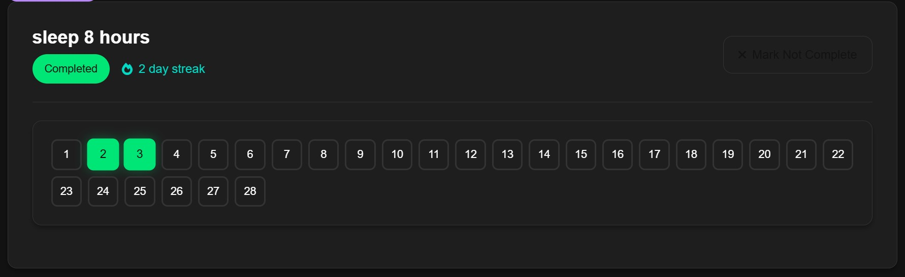
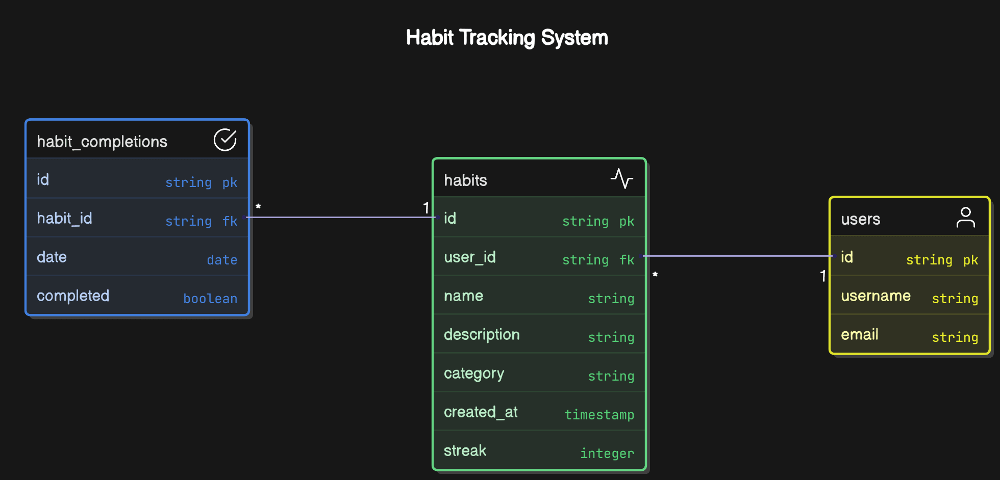
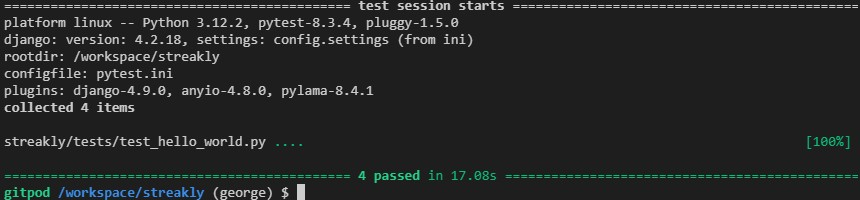
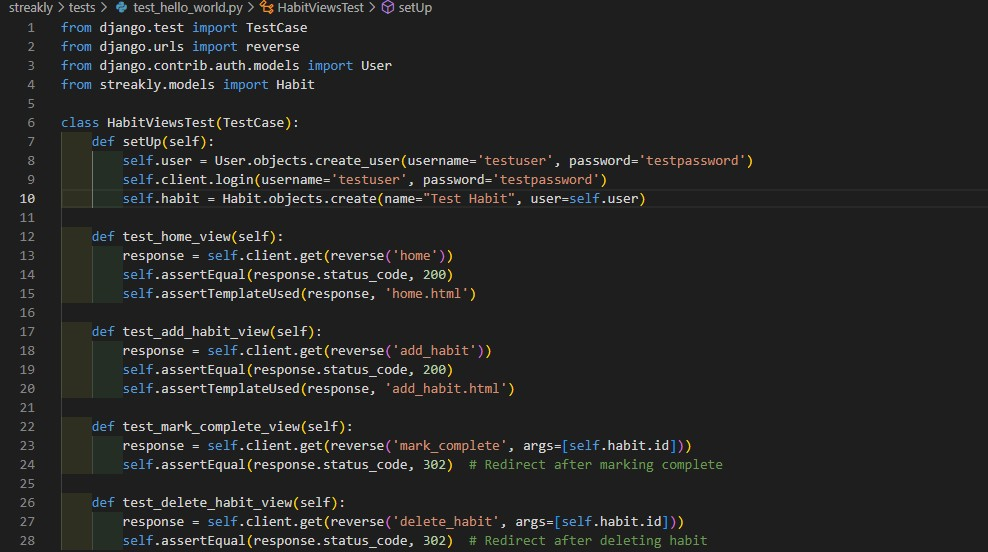

# Streakly

Streakly is a habit-tracking app designed to help users build and maintain positive routines by tracking their daily progress and streaks. It was developed collaboratively using Agile methodology, as the final hackathon on the Code Institute 4 Month Full-Stack Bootcamp.

<a href="https://streakly-17f4cb89efa1.herokuapp.com/" target="_blank">Live project</a>

## Contents
* [User Experience](#user-experience-ux)
    * [User Stories](#user-stories)
    * [User Goals](#user-goals)

* [Design](#design)
    * [Colour Scheme](#colour-scheme)
    * [Typography](#typograhy)
    * [Wireframes](#wireframes)

* [Features](#features)
    * [General Features](#general-features)
    * [Future Implementation](#future-implementation)

* [Technologies Used](#technologies-and-languages-used)
    * [Languages Used](#languages-used)
    * [Frameworks, library and programs](#frameworks-library-programs)
    * [AI Guided](#ai-guided)
    * [ERD](#entity-relationship-diagram)

* [Deployment](#deployment)
    * [Deployment](#deploy)

* [Testing](#testing)
    * [Bugs](#bugs)

* [Credits](#credits)
    * [Code Used](#code-used)
    * [Content](#content)
    * [Media](#media)
    * [Acknowledgments](#acknowledgments)

    ## User Experience (UX)
    ### User Stories
    

    GitHub Project boards were used for our Agile Methodology. 
    

    <ul>
    <li>As a <strong>user</strong> I can <strong>add a new habit</strong> so I can <strong>track my progress over time</strong></li>
    <li>As a <strong>user</strong>, I can <strong>mark a habit as completed for a specific day</strong>, so that I can <strong>keep track of my consistency.</strong></li>
    <li>As a <strong>user</strong>, I can <strong>see my streak</strong> so that I can <strong>stay motivated</strong>.
    <li>As a <strong>user</strong>, I can <strong>organise my habits into categories (e.g., health, productivity)</strong>, so that I can <strong>track different aspects of my life separately.</strong></li>
    <li>As a <strong>user</strong>, I can <strong>log in and log out of my account</strong>, so that <strong>my habit data remains private and accessible only to me.</strong></li>
    <li>As a <strong>user</strong>, I can <strong>create an account</strong>, so that <strong>I can track my habits securely.</strong></li>
    <li>As a <strong>user</strong>, I can <strong>see a weekly view of my habit completions</strong>, so that I can <strong>track my short-term progress visually.</strong></li>
    <li>As a <strong>user</strong>, I can <strong>edit or delete a habit</strong>, so that I can <strong>update my tracking based on changes in my routine.</strong></li>
    <li>As a <strong>mobile user</strong>, I can <strong>use a simple and mobile-friendly design</strong>, so that I can <strong>log my habits easily from any device.</strong></li>
    </ul>
    
<a href="#streakly">Back To Top</a>

    ### User Goals

    

    
<a href="#streakly">Back To Top</a>

    ## Design
    ### Colour Scheme
    
    

    
This colour palette combines the bold vibrancy of electric green (#05F26C) and rich lavender (#B385F2) against a sleek contrast of deep black (#121212) and crisp white (#FFFFFF).

    

    
<a href="#streakly">Back To Top</a>

    ### Typography
    

    
We chose the 'Inter' font for its high degree of readability and modern aesthetic.
 
    Heading 1 
    Heading 2 
    Heading 3 
    Streakly is a habit tracking app 
    

    
<a href="#streakly">Back To Top</a>

    ### Wireframes
    Desktop Wireframe
    

    Mobile Wireframe
    
    

    
<a href="#streakly">Back To Top</a>

    ## Features
    ### General Features

    #### Habit Tracking Calendar
    
    
Each habit displays a calendar, showing the days of the current month. Marking the habit as complete marks the current day as completed. A score is generated based on the consecutive number of days completed.
 

    

    
<a href="#streakly">Back To Top</a>

    ### Future Implementation

    

    #### Friends List
    
Our original idea was to implement a friends list feature, so that users could see the streaks of their friends and compete with them. Due to time constraints we weren't able to implement this feature, but we hope to in future

    #### Encouraging Messages
    
We hope to create conditional messages that appear for the user when they hit certain targets. This could be 7 consecutive days, or a set monthly %age completed.

    
<a href="#streakly">Back To Top</a>

    ## Technologies Used
    ### Languages Used
    
    
    
    

    
    
    
    

    

    
<a href="#streakly">Back To Top</a>

    ### Frameworks, Library and Programs
    
    
    
    
    

    

    
<a href="#streakly">Back To Top</a>

    ### AI Reflection
    
During this hackathon, AI played a crucial role in speeding up development and troubleshooting. Django’s detailed tracebacks were sometimes overwhelming, but AI helped us quickly interpret them, pinpointing the root causes of errors and suggesting fixes. It also streamlined our testing process with pytest—rather than spending time learning test syntax, we leveraged AI to generate and run tests automatically, ensuring our code was robust without diverting focus from feature development. This allowed us to work more efficiently, solving issues faster and maintaining momentum throughout the event.

    

    
<a href="#streakly">Back To Top</a>

    ### Entity Relationship Diagram
    

    

    
<a href="#streakly">Back To Top</a>

    ## Deployment
    ### Deploy
    This [Github](https://github.com) project was created with the code institute template in mind. After some issues with editing, it was most ideal to create a separate project to implement a clean usable README.md file.

    Setup a repo using this method and template:
    1. Login to your GitHub profile.
    2. Navigate to the Code Institute Full Template
    3. Click the dropdown for 'Use this template' and select "Create a new repository"
    4. Generate the necessary name and description for your repo and click 'Create repository from template'
    5. Navigate to the new repo and click the green 'Open' button with the Gitpod logo 
    **IMPORTANT - This button should only be clicked once to generate the new IDE workspace**
    6. You can now work on your repository within the Code Institute Gitpod IDE workspace

    Once the project repo is created, an early deployment for the live project should performed. 
    This allows for early and continuous testing using a variety of devices, as well as the Dev Tools available within browsers.

    Additional information on the deployment process can be found on the official [GitHub Docs](https://docs.github.com/en/pages/quickstart)

    ### Deployment with Heroku
    
We used Heroku for our production server. However, we encountered a deployment issue with the latest version of Python, which prompted us to downgrade to version 3.12.2, resolving the compatibility problem and ensuring successful deployment.

    

    
<a href="#streakly">Back To Top</a>

    ## Testing
    ### Pytest
    
We did our testing using Pytest. We tested the functions of each of the views. The testing code was automatically generatred using Copilot

    

    
Testing code

 

We created tests which checked whether the function of each Django view executed correctly. The succesfull test result shown above demonstrate habits have CRUD functionality.

    

    

    
    

    A quick look on pep8 (Code Institute) to see how the code we created looks, offered a few different pages corrections such as these:

    

    ### Bugs

    

    
<a href="#streakly">Back To Top</a>

    ## Credits
    ### Code Used
    Project and primary learning supplied by [Code Institute](https://codeinstitute.net.ie) 
    
    Supplemental learning resources directly used/ referenced within the project:
    - [Bootstrap Docs](https://getbootstrap.com/docs/5.3)
    - [Gemini](https://gemini.google.com) as a learning tool, no code was directly used
    - [Cloudinary](https://cloudinary.com/tools/image-to-webp) to convert images from jpg to webp
    - [Deep Seek](https://chat.deepseek.com/) AI Chatbot which had a feature that went more in depth, with the chance of looking at the "thought process" before offering a solution.

    

    
<a href="#streakly">Back To Top</a>

    ### Content Research

    

    
<a href="#streakly">Back To Top</a>

    ### Media

    

    
<a href="#streakly">Back To Top</a>

    ### Acknowledgments

    

    
<a href="#streakly">Back To Top</a>
